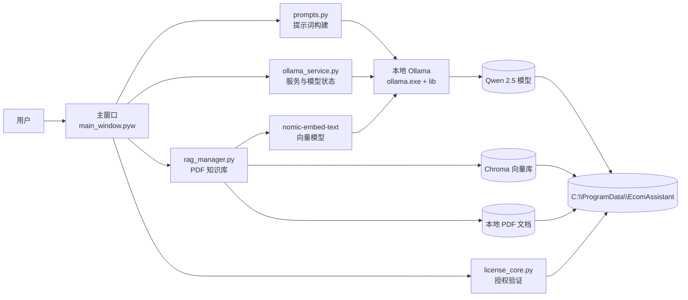

# 电商运营助手

一款基于本地大模型的 Windows 电商内容运营助手，支持商品文案、工作汇报、短视频脚本和 PDF 知识库检索。  
[从 GitHub Releases 下载最新版](https://github.com/Matthew-cell-maker/E-commerce-AI-Operations-Assistant/releases/latest/download/E-commerce.Operations.Assistant_Installer.exe)

## 主要功能

- 爆款标题生成
- 商品推广软文生成
- 日常汇报、转正述职、年度汇报
- 短视频脚本生成
- 导入产品说明书、竞品报告、平台规则等 PDF 文档
- 基于本地知识库生成更符合产品资料的内容
- 本地 Ollama 推理，不依赖云端 API
- 根据显卡显存选择合适的模型档位

## 系统架构



程序默认在本机完成文本生成、PDF 向量化和知识库检索；运行数据统一保存在 `C:\ProgramData\EcomAssistant`。

## 安装与运行

### 运行环境

- Windows 10/11，64 位
- 建议内存不低于 8 GB
- 需要预留模型文件和运行缓存空间

当前 0123 版本为 NVIDIA/CPU/Vulkan 版本，因为加上AMD ROCm 运行库安装包大小超出限制无法上传，所以不包含 AMD ROCm 运行库；AMD 显卡用户需要使用包含 ROCm 的专用版本。
AMD 显卡用户需要使用请联系邮箱zhengmx2000@gmail.com。

### 安装步骤

1. 前往项目发布页下载最新 Windows 安装包。
2. 双击 `电商运营助手_安装程序.exe`。
3. 按安装向导完成安装，建议使用纯英文安装路径，例如 `C:\Program Files\EcomAssistant`。
4. 从桌面快捷方式或开始菜单启动“电商运营 AI 助手”。
5. 首次启动时选择模型档位，等待模型下载完成后即可输入商品名称或主题并生成内容。

模型默认保存到：

```text
C:\ProgramData\EcomAssistant\models
```

## 支持的模型

程序当前使用 Qwen 2.5 系列模型：

- `qwen2.5:1.5b`
- `qwen2.5:3b`
- `qwen2.5:7b`
- `nomic-embed-text`（PDF 知识库向量模型）

首次使用需要下载模型，模型文件不会放在 GitHub 源码仓库中。

## PDF 知识库

在“产品资料库”中上传 PDF 后，程序会自动完成文字提取、切片和向量化。支持的限制：

- 单个文件最大 100 MB
- 单个文件最多 500 页
- 仅支持包含文字层的 PDF；扫描图片 PDF 需要先进行 OCR

## 项目结构

```text
源码与构建文件/
├─ main_window.pyw      主窗口和用户交互
├─ rag_manager.py       PDF 导入与知识库检索
├─ ollama_service.py    Ollama 服务与模型查询
├─ prompts.py           内容生成提示词
├─ license_core.py      本地授权验证
├─ build_app.spec       PyInstaller 打包配置
├─ installer.iss        Inno Setup 安装配置
├─ logo.ico             应用图标
└─ README.md            项目说明

电商运营助手/
├─ 电商运营助手.exe    免安装启动程序
├─ ollama.exe           本地 Ollama 引擎
├─ lib/                 Ollama 推理运行库
└─ _internal/           PyInstaller 运行依赖
```

源码目录用于开发和重新构建；`电商运营助手` 目录是可直接运行的免安装版本；`电商运营助手_安装程序.exe` 是推荐发给普通用户的安装版本。

## 常见问题

### 模型未下载或下载失败

首次启动需要下载 Qwen 模型和 `nomic-embed-text` 向量模型。请确认网络正常、磁盘空间充足，并在模型下载窗口完成后再使用。模型默认保存到：

```text
C:\ProgramData\EcomAssistant\models
```

如果下载中途取消，重新打开程序即可继续检查并下载缺少的模型。

### Ollama 未启动

程序会优先复用本机已有的 Ollama 服务；没有可用服务时，会启动安装目录中的 `ollama.exe`。如果提示端口 `11434` 被占用，请先关闭占用该端口的程序，或确认已有 Ollama 服务能够正常响应。

请不要单独删除以下文件：

```text
ollama.exe
lib\ollama\
```

### 内存或显存不足

请在首次启动时选择较小的模型档位。`qwen2.5:1.5b` 占用资源最少，`qwen2.5:7b` 生成质量更好但需要更多内存和显存。没有独立显卡时可以使用 CPU，但生成速度会明显变慢。运行期间请关闭占用大量内存的其他程序，并确保系统盘有足够空间。

### PDF 无法导入

仅支持有效的文字型 PDF，单个文件最大 100 MB、最多 500 页。扫描版 PDF 需要先进行 OCR；加密 PDF 需要先解除密码保护。

## 隐私说明

文本生成和 PDF 检索默认在本机完成。上传的 PDF、模型、向量库和授权记录保存在本机 `ProgramData` 目录中。

## 注意事项

- 请不要删除安装目录中的 `ollama.exe`、`lib` 或 `_internal` 文件夹。
- 如果 11434 端口已被其他程序占用，请先关闭该程序再启动助手。
- 当前仓库主要用于源码和构建配置；最终安装包建议通过 Release 或其他文件分发方式提供。
